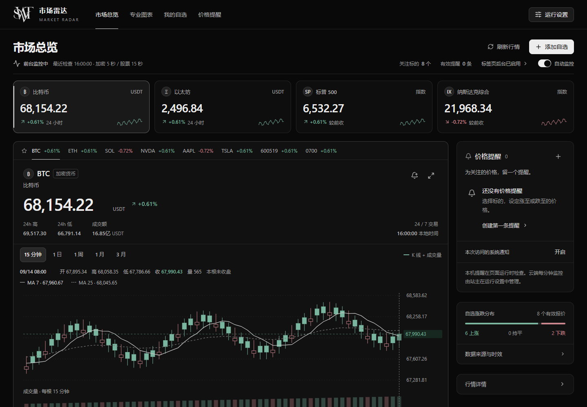

# Market Radar · 市场雷达

一个为桌面与手机设计的中文市场行情工作台。界面采用黑白主调和低饱和涨跌色，支持实时行情、自选列表、15 分钟 K 线、价格提醒和可选的云端监控。



## 功能

- OKX 欧易 USDT 现货报价与 15 分钟 K 线。
- Yahoo Finance 美股、A 股、港股和兼容的旧 USD 交易对行情。
- K 线拖动、双指或 `Ctrl + 滚轮` 缩放、快捷回到最新行情。
- 最多 20 个本机自选，支持市场筛选、涨跌排序和价格提醒。
- 访问码保护；可选独立 Cloudflare Worker + D1 云端监控。
- 适配 320 px 手机、平板和桌面，支持键盘与 `prefers-reduced-motion`。

## 技术栈

React 19、TypeScript、Vinext、Vite、Tailwind CSS、Radix UI、Recharts 和 Cloudflare Workers。运行环境需要 Node.js 22.15 或更高版本。

## 本地开发

```bash
npm ci
cp .env.example .dev.vars
npm run dev
```

在 `.dev.vars` 中填写：

- `ACCESS_CODE_HASH`：访问码去除空格与连字符、转为大写后的 SHA-256。
- `ACCESS_SESSION_SECRET`：至少 32 个字符的随机字符串。
- `SITE_OWNER_EMAIL`、`MONITOR_URL`、`MONITOR_TOKEN`：仅启用云端监控时需要。

构建和测试：

```bash
npm run build
npm test
```

Windows 环境中的项目脚本依赖 Bash；也可以直接执行 `node node_modules/vinext/dist/cli.js build` 验证构建。

## 项目结构

- `app/market-radar.tsx`：行情工作台和主要交互。
- `components/candle-chart.tsx`：15 分钟 K 线及视口交互。
- `lib/market-data.ts`、`lib/okx.ts`：行情聚合与数据源。
- `worker/access-gate.ts`：访问码验证。
- `monitor/`：可选的云端定时监控 Worker 和 D1 schema。
- `tests/`：行情、提醒、访问控制、图表与刷新策略测试。
- `docs/`：架构、接口约定、设计决策和验证说明。

本轮视觉与交互改进的前后数据和截图见 [`docs/VISUAL_REFINEMENT.md`](docs/VISUAL_REFINEMENT.md)。

## 数据与安全边界

行情接口可能延迟、限流或暂时中断。页面会保留并标记上次报价；过期、休市或失败报价不会触发提醒。系统只监控行情，不执行交易，也不需要交易账户凭据。

本机自选和提醒保存在浏览器。云端监控需要单独部署 `monitor/worker.mjs`、配置 D1 和服务端密钥。不要提交 `.env`、`.dev.vars`、访问码、Token 或构建产物。

项目中的品牌标识归其设计者所有。第三方行情数据受对应数据提供方条款约束。
