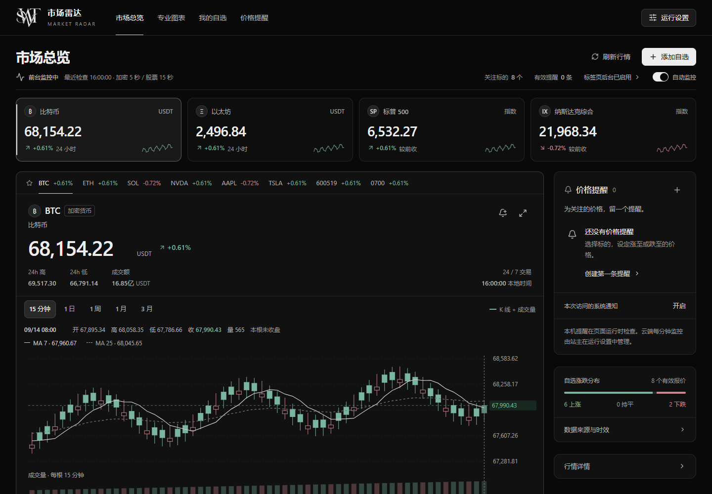

# Market Radar · 市场雷达

面向桌面和手机的中文行情工作台：查看市场 → 发现异常 → 理解证据 → 进入图表 → 关注与跟踪。黑白主调、低饱和涨跌色，支持加密货币、美股、A股与港股。

**当前发布：2.8 Foundation / Sites v28**（2026-10-02），部署源码 `75cfa06`。这是历史智能阶段版，真实价格历史回补、长期保管与真实研究验收仍待完成。

[打开网站](https://market-radar-rex.swt-aether.chatgpt.site) · [文档导航](docs/README.md) · [数据与示例](data/README.md) · [版本记录](docs/VERSIONS.md) · [更新日志](CHANGELOG.md)



## 现在可以做什么

| 区域 | 已有能力 |
| --- | --- |
| Classic 行情工作台 | 真实报价、可拖动/缩放K线、最多20个本机自选、价格提醒 |
| Radar 异常情报 | 异动、突破/跌破、波动及可靠量能异常；证据、置信度、事件聚合和确定性摘要 |
| 资产与自选状态 | 90/180分钟方向与RMS波动、适用基准下的短窗相对表现、维度关系和历史窗口比较；分维度说明缺失数据 |
| 双向工作流 | 同资产Classic ⇄ Radar ⇄ 图表，保留手动周期，共用自选与价格提醒 |
| 历史回放与研究 | 导入受限模拟历史包、按截止时间查询、方向/RMS回放和固定协议相近样本研究 |
| 官方宏观资料 | 导入本地公开视图，按UTC日期查询、分页及追溯来源；附两条既有FED公开元数据 |

支持手机、平板、桌面、键盘操作和「跟随系统 / 标准 / 减少」动效偏好。状态与研究描述数据，不提供买卖评分、价格预测或交易执行。

## 使用示例与当前边界

在Radar展开「历史回放与研究」或「官方宏观资料」，下载对应示例后导入。文件只在当前页面读取；刷新后需重新导入。

- **实时行情**继续使用现有OKX USDT及Yahoo股票/兼容USD数据源。
- **历史价格导入**仅接受明确标记的模拟数据；302根示例不是已完成的真实回补或预测成绩。
- **FED示例**是两条既有公开元数据，保留原来源和时间；不代表当前RSS、完整九月资讯或个股公告。
- **本地归档工具**不随网站部署成为持续采集服务。来源许可、正式资产集合、历史覆盖与长期备份仍由[2.8任务](tasks/MR-HISTORICAL-INTELLIGENCE-28.md)跟踪。

发布前验收：281项Node测试、构建/类型检查、受影响lint、19项相关浏览器检查及独立审计通过。浏览器结果来自本地五视口模拟，不代表生产登录后或iPhone真机复测。既有全仓lint债务保留。详见[历史智能报告](docs/HISTORICAL_INTELLIGENCE.md)和[发布记录](tasks/archive/MR-PUBLISH-HISTORY28-FOUNDATION.md)。

## 本地开发

React 19、TypeScript、Vinext/Vite、Tailwind CSS、Cloudflare Workers；Node.js要求 **≥22.15.0**。依赖版本以[package.json](package.json)和锁文件为准。

安装依赖后，将 `.env.example` 复制为 `.dev.vars` 并填写本机配置。仅首次复制，保留已有配置；密钥含义见[项目速览](docs/PROJECT.md)。

```bash
npm ci
cp -n .env.example .dev.vars
npm run dev
```

PowerShell启动入口（依赖已安装）：

```powershell
if (!(Test-Path -LiteralPath '.dev.vars')) {
  Copy-Item -LiteralPath '.env.example' -Destination '.dev.vars'
}
$env:WRANGLER_LOG_PATH = '.wrangler/wrangler.log'
node node_modules/vite/bin/vite.js
```

标准验证：

```bash
npm test       # 已包含build、typecheck及全量Node测试，不必先重复build
npm run lint
```

部分npm包装脚本依赖Bash/Linux工具；PowerShell构建、单项测试及浏览器限制见[开发与验证](docs/PROJECT.md#开发与验证)。

## 从哪里读代码

| 路径 | 职责 |
| --- | --- |
| [app/market-radar.tsx](app/market-radar.tsx) | 页面共同状态、行情调度、Classic/Radar集成 |
| [components/radar/](components/radar/) | Radar、自选状态、资产详情、宏观资料与历史展示 |
| [components/candle-chart.tsx](components/candle-chart.tsx) | K线与图表交互 |
| [lib/radar/](lib/radar/) | 输入有效性、Engine、Intelligence、State及工作流纯逻辑 |
| [lib/history/](lib/history/) | 历史包校验、独立回放及描述性研究 |
| [lib/market-data.ts](lib/market-data.ts)、[lib/okx.ts](lib/okx.ts) | 行情聚合与来源适配 |
| [worker/](worker/) / [monitor/](monitor/) | 网站入口与门禁 / 可选独立云监控 |
| [collector/](collector/) / [scripts/](scripts/) | 本地SQLite归档、有限来源采集及显式运行工具 |
| [tests/](tests/) | Node、隔离浏览器和性能验证 |
| [docs/](docs/README.md) / [tasks/](tasks/ACTIVE.md) | 契约与证据 / 任务索引和归档 |

## 文件保管与版本

公开示例位于 `public/examples/`，精选截图和摘要位于 `docs/`；原始库、备份、个人资料和日志保留在Git忽略的 `work/`、`data/local/`、`outputs/`。见[数据索引](data/README.md)。项目内整理不等于异地备份。

网站有访问码门禁，本机自选和提醒保存在浏览器。可选云监控需独立部署Worker、配置D1和站主权限。不要提交 `.env`、`.dev.vars`、密钥、原始数据库或构建产物。第三方数据受来源条款约束，品牌标识归其设计者所有。

`radar-v2.8-foundation` 与 `sites-v28` 指向同一部署源码；后续文档或注释提交不代表重新部署。全部版本与回退点见[版本索引](docs/VERSIONS.md)。
